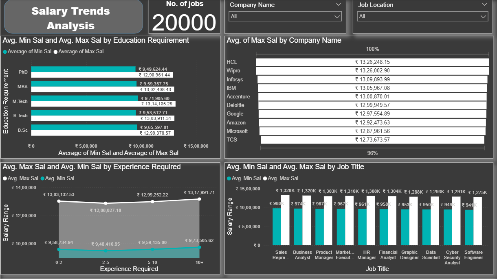
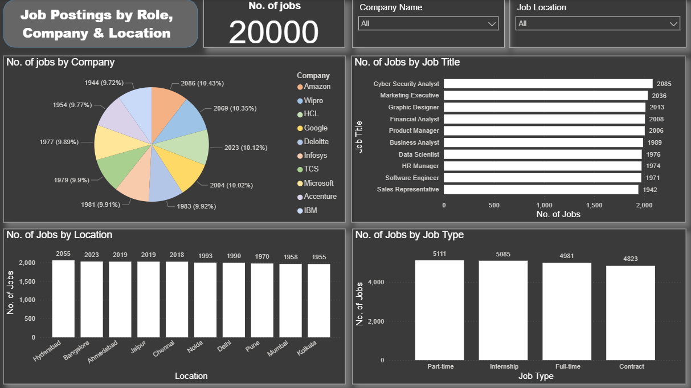
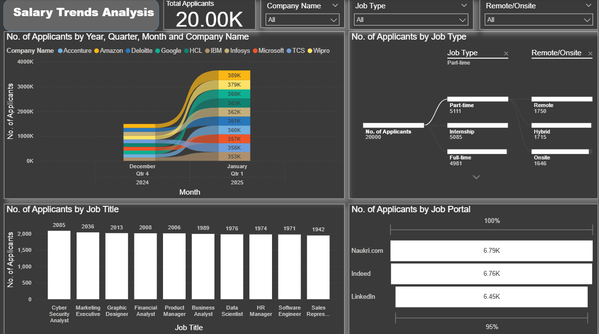

# 🌟 Job Analysis Dashboard 📊

 <!-- Replace with your project banner image if available -->

## 🎯 Overview

Welcome to the **Job Analysis Dashboard**! 🚀 This interactive dashboard, built with Microsoft Power BI, dives deep into job market trends, salary insights, and applicant data. Whether you're a recruiter, job seeker, or data enthusiast, this dashboard helps you uncover patterns in job postings, salaries, and applicant behavior across companies, locations, and roles. 📈

The dashboard is split into three insightful pages:
1. **Salary Trends Analysis** 💰: Explore salary ranges by education, experience, and job title.
2. **Job Postings by Role, Company & Location** 🏢: Analyze job postings by company, location, and job type.
3. **Job Market Overview** 📅: Track applicant trends over time, by job title, and job portal.

**Total Jobs Analyzed**: 2000+ ✨  
**Dataset**: `india_job_market_dataset` 🇮🇳

## ✨ Key Features & Insights

### 📊 Salary Trends Analysis
- **Salary by Education** 🎓: 
  - PhD holders earn the highest average max salary at ₹19,29,252! 💡
  - B.Tech graduates have an average max salary of ₹13,55,571.
- **Salary by Experience** ⏳:
  - 10+ years of experience fetches up to ₹17,91,971 on average.
  - Entry-level (0 years) averages ₹9,75,505.
- **Salary by Job Title** 🖥️:
  - Software Engineers lead with an average max salary of ₹13,94K.
- **Top Companies by Salary** 🏆:
  - HCL offers the highest average max salary at ₹13,26,248! 🥇
  - Followed by Wipro (₹13,26,002) and Infosys (₹13,09,893).

### 🏢 Job Postings by Role, Company & Location
- **Top Companies** 🏬:
  - Amazon leads with 1944 postings (9.77%). 📦
  - Wipro (2006) and HCL (2023) follow closely.
- **Top Locations** 📍:
  - Hyderabad tops with 2025 jobs, followed by Bangalore (2019).
- **Job Types** ⏰:
  - Full-time roles dominate with 5111 postings.
  - Internships (1750) and Part-time roles (481) are also significant.

### 📅 Job Market Overview
- **Applicant Trends** 📈:
  - Applications peaked in Jan 2025 (387K applicants across companies like Amazon, TCS, and Google).
  - Historical data shows a rise from 135K applicants in Dec 2024.
- **By Job Title** 💼:
  - Cyber Security Analyst roles attracted 2085 applicants.
  - Sales Representatives saw 1942 applicants.
- **By Job Portal** 🌐:
  - Naukri.com leads with 679K applications, followed by Indeed (676K) and LinkedIn (645K).

## 🖼️ Screenshots

### 💰 Salary Trends Analysis
  
*See salary trends by education, experience, and job title! 📉*

### 🏢 Job Postings by Role, Company & Location
  
*Explore job postings by company, location, and job type! 🗺️*

### 📅 Job Market Overview
  
*Track applicant trends over time, by job title, and portals! ⏳*

> **Tip** 💡: Replace the screenshot placeholders (`screenshots/salary-trends-analysis.png`, etc.) with the actual file paths after uploading the images to your GitHub repository.

## 🛠️ Technologies Used

- **Microsoft Power BI** 🖥️: For creating stunning visualizations.
- **Data Source** 📂: `india_job_market_dataset` (CSV/Excel format).

## 🚀 Actions to Be Taken Based on Insights

Here are actionable steps based on the dashboard insights to help recruiters, HR teams, and job seekers make informed decisions:

### 💰 For Recruiters & HR Teams
- **Optimize Salary Offerings** 💸:
  - Offer competitive salaries for PhD holders (around ₹19,29,252) to attract top talent in research-heavy roles.
  - For B.Tech graduates, aim for at least ₹13,55,571 to stay competitive, especially for Software Engineer roles (₹13,94K avg max).
- **Target Experienced Candidates** ⏳:
  - Prioritize candidates with 10+ years of experience for senior roles, offering up to ₹17,91,971 to match market standards.
  - For entry-level roles, budget around ₹9,75,505 to attract fresh talent.
- **Focus on High-Demand Roles** 🖥️:
  - Increase hiring for Software Engineers and Cyber Security Analysts, as they attract high applicant numbers (2085 for Cyber Security Analysts).
- **Compete with Top Companies** 🏆:
  - Benchmark salaries against HCL (₹13,26,248) and Wipro (₹13,26,002) to remain competitive in the market.

### 🏢 For Job Postings Strategy
- **Expand in High-Demand Locations** 📍:
  - Post more jobs in Hyderabad (2025 jobs) and Bangalore (2019 jobs) to tap into large talent pools.
  - Consider expanding to cities like Chennai or Pune, which show growing potential.
- **Diversify Job Types** ⏰:
  - While Full-time roles (5111) dominate, increase Internship (1750) and Part-time (481) postings to attract students and flexible workers.
- **Partner with Top Companies** 🏬:
  - Collaborate with Amazon, Wipro, and HCL for joint hiring initiatives, as they lead in job postings.

### 📅 For Job Seekers & Career Planning
- **Target High-Application Roles** 💼:
  - Focus on Cyber Security Analyst (2085 applicants) and Sales Representative (1942 applicants) roles, which are in high demand.
- **Leverage Popular Job Portals** 🌐:
  - Prioritize applying through Naukri.com (679K applications) and Indeed (676K), as they have the highest applicant traffic.
- **Upskill for High-Paying Roles** 🎓:
  - Pursue a PhD or gain 10+ years of experience to target high-salary roles (up to ₹19,29,252 for PhDs, ₹17,91,971 for 10+ years).

